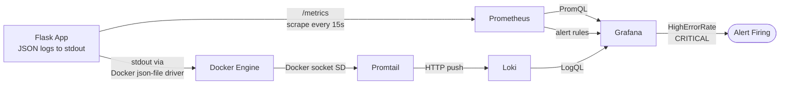
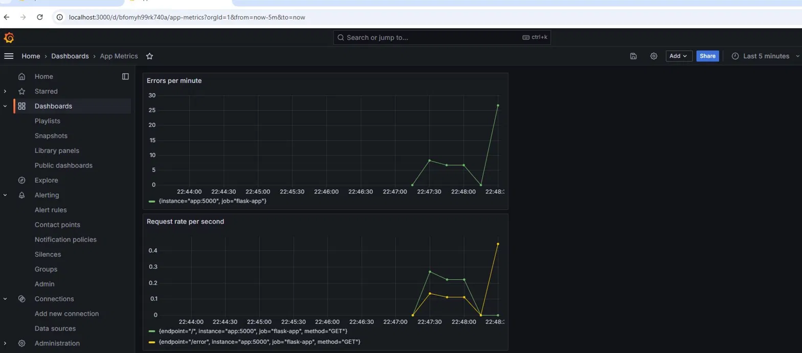
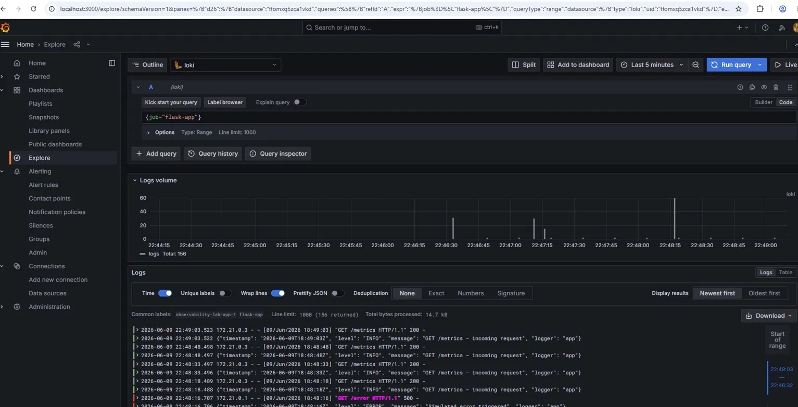
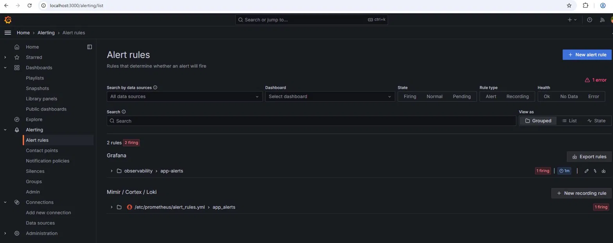

# DevOps Observability Lab

A complete observability stack for a containerized Python application — metrics, logs, dashboards, and alerting — deployable with a single command.

## Stack

| Layer | Tool |
|---|---|
| Application | Flask 3 + `prometheus-client` |
| Metrics collection | Prometheus |
| Log collection | Promtail (Docker service discovery) |
| Log storage | Loki |
| Visualization & Alerting | Grafana |
| Orchestration | Docker Compose |

## Architecture



**Data flow:**

1. The Flask app exposes Prometheus counters at `/metrics` and writes JSON logs to stdout.
2. Prometheus scrapes `/metrics` every 15 seconds and evaluates alert rules.
3. Docker captures stdout via the `json-file` logging driver.
4. Promtail discovers the app container through the Docker socket, tails its logs, and pushes them to Loki.
5. Grafana queries both Prometheus (metrics) and Loki (logs) through a single UI and evaluates alerts on the metric stream.

## Quick Start

```bash
git clone <this-repo>
cd observability-lab
docker compose up -d
```

That's it. The whole stack is up.

| Service | URL | Credentials |
|---|---|---|
| Flask app | http://localhost:5000 | — |
| App metrics endpoint | http://localhost:5000/metrics | — |
| Prometheus | http://localhost:9090 | — |
| Grafana | http://localhost:3000 | `admin` / `admin` |
| Loki API | http://localhost:3100 | — |

## Project Structure

```
.
├── app/
│   ├── app.py                  # Flask app with /metrics, /, /error
│   ├── Dockerfile
│   └── requirements.txt
├── prometheus/
│   ├── prometheus.yml          # Scrape config
│   └── alert_rules.yml         # HighErrorRate alert
├── loki/
│   └── loki-config.yml
├── promtail/
│   └── promtail-config.yml     # Docker socket-based log discovery
├── docker-compose.yml
└── README.md
```

## Application Endpoints

| Endpoint | Method | Description |
|---|---|---|
| `/` | GET | Returns 200, increments `app_requests_total{endpoint="/"}` |
| `/error` | GET | Returns 500, increments `app_requests_total{endpoint="/error"}` and `app_errors_total` |
| `/metrics` | GET | Prometheus metrics endpoint |

### Custom Metrics

- `app_requests_total{method, endpoint}` — total requests by method and endpoint
- `app_errors_total` — total simulated errors

## Implementation Details

### Logging Strategy

The Flask app uses Python's `logging` module with a custom `JSONFormatter` that emits one JSON object per log line:

```json
{"timestamp": "2026-06-09T18:48:16Z", "level": "ERROR", "message": "Simulated error triggered", "logger": "app"}
```

Logs are written to **stdout** and captured by Docker's default `json-file` driver. **Promtail** runs as a sidecar and uses **Docker service discovery** via the Docker socket (`/var/run/docker.sock`) to automatically find and tail the application container's logs. It then pushes them to Loki with the label `job="flask-app"`.

This pull/push pipeline (Docker → Promtail → Loki) means the application doesn't need to know anything about the logging infrastructure — it just writes to stdout. Promtail handles all the routing.

### Triggering the CRITICAL Alert

The alert rule (`prometheus/alert_rules.yml`) fires when more than 5 errors occur within a 1-minute window:

```yaml
- alert: HighErrorRate
  expr: increase(app_errors_total[1m]) > 5
  for: 0m
  labels:
    severity: critical
  annotations:
    summary: "CRITICAL: High error rate detected"
    description: "App has produced more than 5 errors in the last minute."
```

To simulate the alert, hit `/error` more than 5 times within a minute:

```bash
for i in {1..10}; do curl -s http://localhost:5000/error; done
```

Then wait up to ~1 minute (one evaluation interval) and check the alert state:

- **Grafana**: navigate to **Alerting → Alert rules** and look for `HighErrorRate` to flip to **Firing**.
- **Prometheus**: navigate to http://localhost:9090/alerts.

## Evidence

### 1. Grafana Dashboard — Custom Application Metrics

The "App Metrics" dashboard shows `app_errors_total` (errors per minute) and `app_requests_total` (request rate per second, split by endpoint).



### 2. Filtered JSON Logs in Grafana (Loki)

Query: `{job="flask-app"}` — the Loki data source returns the structured JSON log lines collected by Promtail.



### 3. Active Alert Rule (Firing)

The `HighErrorRate` alert in the **Alerting → Alert rules** tab, showing the **Firing** state after triggering more than 5 errors per minute.



## Analysis

### Why is JSON-structured logging more efficient than plain text?

Plain text logs are a single string per line — to extract any field (severity, timestamp, request ID), a downstream tool has to apply regex or string parsing, which is fragile and breaks the moment the format changes. JSON logs are already key-value structured, so a log aggregator can index them directly: filtering by `level="ERROR"` becomes a field lookup instead of a substring match. This is faster at query time, more reliable, easier to evolve (adding a new field doesn't break existing parsers), and removes ambiguity around things like multi-word messages or stack traces that often confuse plain-text parsers.

### What is the fundamental technical difference between Prometheus and Loki?

**Prometheus is a time-series database for numerical metrics.** It stores compact float samples (`metric{labels} value timestamp`) optimized for aggregation, math, and rate calculations. It uses a **pull model** (scrapes `/metrics` endpoints), is highly compressed, and assumes low cardinality on label values.

**Loki is a log aggregation system.** It stores raw log lines (events, not numbers) and only indexes their **labels** — the log content itself is not indexed but stored compressed in chunks. It uses a **push model** (Promtail pushes to Loki). Queries are essentially `grep` over chunks filtered by labels, not mathematical aggregations.

In short: Prometheus answers *"how many / how fast / what percentile?"* on numeric trends. Loki answers *"what happened, and what did the system say about it?"* on event streams. They are complementary — metrics tell you something is wrong; logs tell you why.

### How would you handle long-term log retention (e.g., 6 months) without depleting disk?

A single all-local approach doesn't scale to 6 months. The standard strategy is **tiered storage with aggressive filtering at ingest**:

1. **Object storage backend** — point Loki's `storage_config` at S3, GCS, or Azure Blob instead of the local filesystem. Object storage is ~10× cheaper than block storage and effectively unlimited.
2. **Retention policies** — Loki's compactor supports per-tenant and per-stream retention. Critical logs (errors, audit) keep the full 6 months; noisy logs (health checks, debug) get a much shorter window or are dropped entirely at Promtail via `drop` pipeline stages.
3. **Compression and chunk compaction** — Loki already compresses chunks (gzip/snappy/zstd); the compactor merges small chunks into larger ones to reduce object-storage request costs.
4. **Sampling for high-volume sources** — for very chatty applications, sample one out of N log lines at the agent level rather than storing everything.
5. **Cold archive** — for compliance-only retention beyond the active window, move old objects to a cheaper tier (S3 Glacier, GCS Archive). Queries become slower but cost drops dramatically.

The general principle: **don't keep everything forever on hot storage**. Decide what's queryable now, what's queryable cold, and what's just archived for compliance — and tier accordingly.
